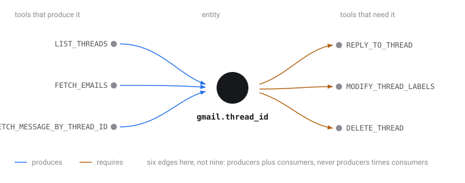

# Tool dependency graph

Agents fail on tool calls for a boring reason: the call needs an argument the
agent has no way to produce. `REPLY_TO_THREAD` wants a `thread_id`, and nobody
has one memorised. It is an opaque handle, and it comes from a prior call.

This builds that map. Given a catalog of tools described by JSON Schema, it
works out which tools must run **before** which, and which arguments have to be
asked of the user instead.

Open **`graph.html`** in a browser. No server, no build step, no network.

## The two shapes it has to get right

**A handle you cannot invent.** Replying to a mail thread needs a `thread_id`.
A thread listing produces one. That is a hard ordering constraint.

**A value that is sometimes a handle.** Sending mail needs an address. If the
user gives one, it is user supplied. If the user gives a *name*, a contacts
lookup has to run first. The same slot is tool derived in one case and not the
other, so the graph has to record both possibilities rather than pick one.

